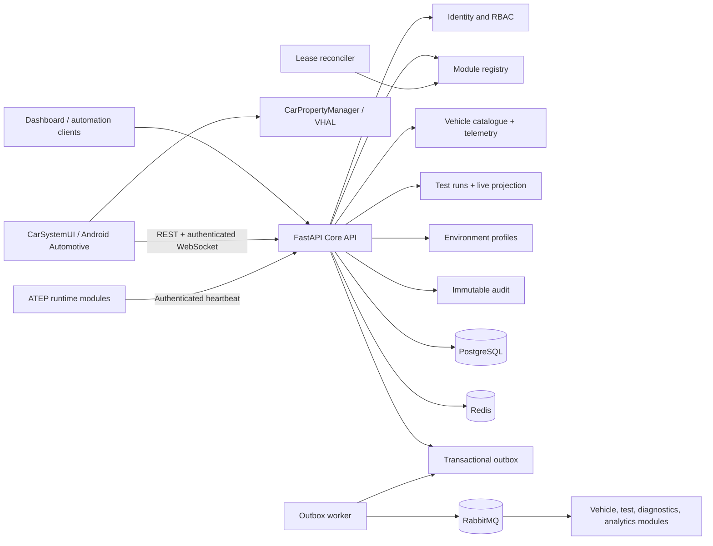
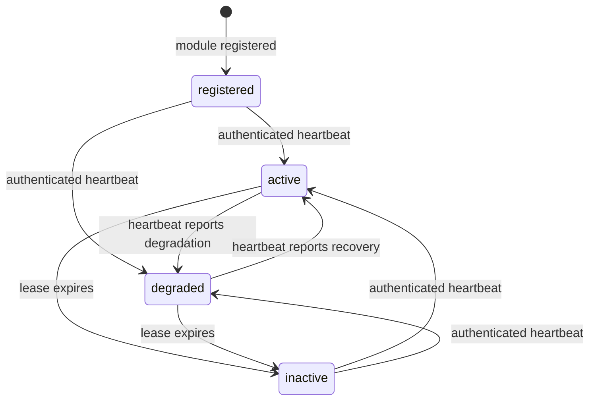

# ATEP — Automotive Test Engineering Platform

[](https://github.com/paulacristinaqa/automotive_test_engineering_platform/actions/workflows/integration.yml)
[](https://github.com/paulacristinaqa/automotive_test_engineering_platform/actions/workflows/security.yml)
[](https://www.python.org/)
[](https://fastapi.tiangolo.com/)
[](https://docs.docker.com/compose/)

ATEP is a portfolio-grade engineering platform for managing, executing, simulating, and
analysing embedded-software tests for electric vehicles. Its long-term goal is to reproduce
the integrated QA ecosystem of an automotive manufacturer: virtual vehicles and ECUs, CAN
networks, diagnostics, electric-powertrain behavior, automated testing, observability, AI-assisted
analysis, and enterprise fleet capabilities.

The repository currently contains the executable foundation of **Volume I — Core Platform**.
Implemented behavior is backed by requirements, architecture decisions, migrations, automated
tests, a disposable integration environment, and an English engineering workbook.

> **Project status:** active development. Volume I, Increment 3 is in progress. The first
> ATEP-to-Android-Automotive integration contract now provides a vehicle catalogue and
> idempotent telemetry and command delivery for the Vehicle Gateway. Persistent test runs now
> publish authenticated live WebSocket updates to CarSystemUI, which continues to isolate
> simulated and AAOS/CarPropertyManager observations behind an explicit property-source boundary.

## Why this project exists

Most personal automotive-testing projects demonstrate an isolated CAN script or a small UDS
example. ATEP is deliberately broader: it explores how security, persistence, events, module
discovery, test automation, observability, and future vehicle simulators work together under
industrial-style engineering constraints.

An intended end-to-end scenario is:

1. a virtual battery develops an abnormal temperature;
2. the BMS ECU publishes the condition over CAN;
3. diagnostics records a DTC;
4. the test framework starts a regression suite;
5. the AI engine analyses evidence and suggests additional tests;
6. the dashboard updates quality, coverage, and failure indicators.

## Current capabilities

- versioned FastAPI control-plane APIs and OpenAPI documentation;
- JWT access tokens and opaque, hash-only refresh-token rotation;
- users, roles, permissions, protected system-role invariants, and deny-by-default RBAC;
- immutable administrative audit evidence with bounded search and formula-safe CSV export;
- PostgreSQL persistence and Alembic migrations;
- Redis-backed distributed authentication and API rate limiting;
- transactional outbox and asynchronous RabbitMQ publication;
- persistent module and versioned capability catalogue;
- raw-once, hash-only module workload credentials;
- authenticated module heartbeats with bounded availability leases;
- automatic reconciliation of expired modules to `inactive`;
- permission-protected aggregate module health with configurable availability objective;
- versioned vehicle catalogue with independent read/manage permissions;
- capability-protected Android Automotive telemetry ingestion with idempotent retry handling;
- persistent vehicle-scoped test runs with controlled, optimistic lifecycle transitions;
- authenticated Redis-backed WebSocket snapshots and live test-run updates for CarSystemUI;
- immutable EV, hybrid, and autonomous environment profiles with reproducible TestRun snapshots;
- structured JSON logging and request correlation IDs;
- liveness and dependency-readiness endpoints;
- versioned Prometheus SLO recording rules, burn-rate alerts, registry alerts, and runbooks;
- internal outbox-worker, scheduler, and WebSocket metrics with backlog/failure alerts;
- bounded PostgreSQL, Redis, RabbitMQ, and artifact-store health/capacity metrics and alerts;
- version-pinned Alertmanager with local grouping, inhibition, resolved delivery, and aggregate-only webhook evidence;
- Docker Compose development and disposable integration environments;
- hash-locked Python dependencies, immutable CI actions and a digest-pinned runtime base image;
- automated secret, dependency, source and container scanning with retained CycloneDX SBOMs;
- Ruff, strict mypy, pytest, and GitHub Actions quality gates.

## Architecture

ATEP begins as a modular control plane with independently deployable workers. Modules are split
into separate services only when scaling, ownership, availability, security isolation, or release
cadence provides a concrete reason.



ATEP and [CarSystemUI_android](https://github.com/paulacristinaqa/CarSystemUI_android) form one
coordinated automotive software-testing platform while retaining separate release histories.
ATEP is the secure control plane, orchestration and evidence backbone. CarSystemUI is the
in-vehicle cockpit, Android Automotive learning surface, simulator and future Vehicle Gateway.
Together they are intended to exercise electric, hybrid and autonomous-vehicle scenarios.

PostgreSQL is the system of record. Redis holds ephemeral coordination and abuse-control state.
RabbitMQ provides at-least-once asynchronous integration, so consumers are expected to be
idempotent and deduplicate by event ID.

## Technology stack

| Area | Technologies |
|---|---|
| API and application | Python 3.12+, FastAPI, Pydantic Settings |
| Persistence | PostgreSQL 17, SQLAlchemy 2, asyncpg, Alembic |
| Messaging and ephemeral state | RabbitMQ, aio-pika, Redis |
| Security | PyJWT, Argon2 via pwdlib, RBAC, hashed workload credentials |
| Quality | pytest, Ruff, strict mypy |
| Runtime | Docker and Docker Compose |
| Observability foundation | structlog, correlation/trace IDs, OpenTelemetry OTLP, Prometheus, Grafana, health probes |

## Repository structure

```text
src/atep/
├── audit/       immutable evidence, search, and export
├── core/        configuration, security, errors, logging, and rate limiting
├── db/          database base types, engine, and sessions
├── events/      transactional outbox and RabbitMQ worker
├── identity/    authentication, users, roles, permissions, and sessions
├── registry/    modules, capabilities, workload credentials, and leases
├── vehicles/    vehicle catalogue and idempotent gateway telemetry
├── api/         shared API and health boundaries
└── main.py      application composition and lifecycle

migrations/      versioned database revisions
tests/           unit, contract, service, and black-box integration tests
docs/            architecture, requirements, roadmap, policies, and workbook
tools/           integration runner and workbook generator
```

## Prerequisites

- Git;
- Docker Desktop with Docker Compose;
- WSL 2 when using Docker Desktop on Windows;
- Python 3.12+ for local development outside containers;
- PowerShell 7 or Windows PowerShell for the disposable integration runner.

## Quick start with Docker

1. Clone the repository:

   ```bash
   git clone https://github.com/paulacristinaqa/automotive_test_engineering_platform.git
   cd automotive_test_engineering_platform
   ```

2. Create the local environment file:

   ```powershell
   Copy-Item .env.example .env
   ```

   On Linux or macOS, use `cp .env.example .env`.

3. Replace `ATEP_JWT_SECRET` and optionally configure the one-time bootstrap administrator.

4. Build and start the platform:

   ```bash
   docker compose up --build
   ```

5. Open the interactive API documentation at <http://localhost:8000/docs>.

The one-shot migration container must complete before the API and outbox worker start.
PostgreSQL, Redis, and RabbitMQ include health checks used by the local topology.

## Local Python development

```powershell
python -m venv .venv
.\.venv\Scripts\Activate.ps1
python -m pip install --require-hashes -r requirements-dev.lock
python -m pip install --no-deps --no-build-isolation -e .
```

Linux or macOS activation:

```bash
source .venv/bin/activate
```

## API overview

| Area | Representative routes | Protection |
|---|---|---|
| Authentication | `POST /api/v1/auth/token`, `/refresh`, `/logout` | Credential or token possession |
| Users | `POST/GET /api/v1/users`, status and role operations | `users:read`, `users:write`, `roles:manage` |
| Roles | `/api/v1/roles` and permission operations | `roles:manage` |
| Audit | `/api/v1/audit-records` and `/export` | `audit:read`, `audit:export` |
| Registry | `/api/v1/modules` and capability operations | `modules:read`, `modules:manage` |
| Workload identity | module credential issuance and rotation | `modules:manage` |
| Heartbeat | `POST /api/v1/modules/{id}/heartbeat` | `X-ATEP-Module-Token` |
| Module health | `GET /api/v1/modules/health-summary` | `modules:read` |
| Vehicles | `/api/v1/vehicles` and status operations | `vehicles:read`, `vehicles:manage` |
| Telemetry ingest | `POST /api/v1/vehicles/{vehicle_id}/telemetry` | Gateway module identity + `vehicle.telemetry.publish` capability |
| Telemetry query | `GET /api/v1/vehicles/{vehicle_id}/telemetry` | `telemetry:read` |
| Test runs | `POST/GET /api/v1/test-runs`, status updates | `test_runs:read`, `test_runs:write` |
| Live test run | `WS /api/v1/test-runs/{run_id}/stream` | active bearer token + `test_runs:read` |
| Environment profiles | `/api/v1/environment-profiles` and lifecycle status | `environment_profiles:read`, `environment_profiles:manage` |
| Health | `/health/live`, `/health/ready` | Development probe policy |

All API failures follow a stable correlation-aware error envelope. Passwords, password hashes,
raw refresh tokens, and raw module credentials are excluded from responses, logs, events, and
audit details except where a newly generated raw token must be returned exactly once.

## Module availability lifecycle



An administrator issues or rotates a high-entropy workload credential. Only its SHA-256 digest
is persisted. A valid heartbeat may report `active` or `degraded`, optionally update the semantic
version, and renew a lease bounded between 5 and 3,600 seconds. The background reconciler marks
expired modules `inactive` and records the transition atomically in audit and outbox evidence.

## Quality and testing

Run the fast quality gates:

```bash
pytest -q
ruff check .
ruff format --check .
mypy src tests
```

Run the complete disposable PostgreSQL, Redis, RabbitMQ, API, outbox, identity, RBAC, audit,
rate-limit, and module-registry scenario on Windows:

```powershell
powershell -NoProfile -ExecutionPolicy Bypass -File .\tools\run_integration_tests.ps1
```

The runner creates ephemeral credentials, uses isolated ports, applies every migration, and
removes its containers, network, and volumes after execution. The latest local evidence records
**97 fast tests plus one expanded Docker integration scenario** passing. The CarSystemUI
companion project also passes 27 unit tests, Android lint, and debug APK assembly for this slice.

## Engineering documentation

- [Architecture and decisions](docs/architecture.md)
- [Volume I requirements](docs/requirements-volume-i.md)
- [Volume I delivery roadmap](docs/roadmap-volume-i.md)
- [Audit retention baseline](docs/audit-retention-policy.md)
- [Observability baseline and runbook](docs/observability.md)
- [Software supply-chain security](docs/software-supply-chain-security.md)
- [Engineering workbook — editable source](docs/workbook-volume-i.md)
- [Engineering workbook — formatted document](docs/ATEP_Volume_I_Engineering_Workbook.docx)

The workbook is a living English-language engineering record containing requirements,
architecture decisions, implementation evidence, test objectives, risks, technical debt,
operational guidance, and review worksheets.

## Project roadmap

| Volume | Domain | Status |
|---|---|---|
| I | Core Platform | In progress |
| II | Digital Vehicle | Planned |
| III | ECU Simulator | Planned |
| IV | CAN Network | Planned |
| V | Diagnostics | Planned |
| VI | Electric Vehicle | Planned |
| VII | ADAS | Planned |
| VIII | Test Framework | Planned |
| IX | AI Test Engineer | Planned |
| X | Dashboard | Planned |
| XI | DevOps | Planned |
| XII | Enterprise Features | Planned |

The runnable CarSystemUI showcase connects simulated or AAOS property changes to this telemetry
contract through a persistent, idempotent Vehicle Gateway. Its read-only CarPropertyManager/VHAL
source labels evidence provenance and never silently substitutes simulator data. A unique,
connectivity-constrained WorkManager job now retries pending telemetry after the activity or
process closes. Rejected observations can now be inspected, retried with their original identity,
or selectively discarded, while exhausted retry work remains visible until explicitly resumed.
Authorized test commands now use an idempotent request, capability-scoped target, bounded lease,
hash-only claim token, safe Android property allowlist, and terminal acknowledgement. The next
slices add area-aware properties and live test-run updates.
Versioned test configuration profiles, scheduler boundaries, artifact storage, and the initial
OpenTelemetry/Prometheus/Grafana observability, aggregate module health, recording rules, and
initial SLO/registry alerts are implemented. Outbox, scheduler, and WebSocket domain telemetry
now covers backlog age, processing failures, and live connection/message behavior. Production
notification-provider routing, threshold/load calibration, and durable trace retention remain
hardening; local dependency/storage signals and Alertmanager delivery are implemented.

## Security and production status

ATEP is currently a development and portfolio platform, not a production vehicle-control system.
Do not reuse example infrastructure credentials outside an isolated local environment. Production
deployment still requires managed secrets, TLS/mTLS or managed workload identity, trusted-proxy
configuration, backup/restore evidence, artifact signing and provenance verification, production
monitoring, and reviewed operational policies. The repository already enforces a development
supply-chain baseline with deterministic dependency locks, immutable build inputs, SBOMs, secret
scanning, dependency auditing, CodeQL, and high/critical container-vulnerability gates.

## Contributing

Contributions and engineering discussions are welcome as the public workflow matures. Before
opening a pull request, keep changes scoped, update relevant requirements and documentation, add
tests for new behavior, and run the available quality gates.

## Author

Developed by [Paula Cristina QA](https://github.com/paulacristinaqa) as an automotive software
testing, embedded-systems, architecture, and quality-engineering portfolio project.
