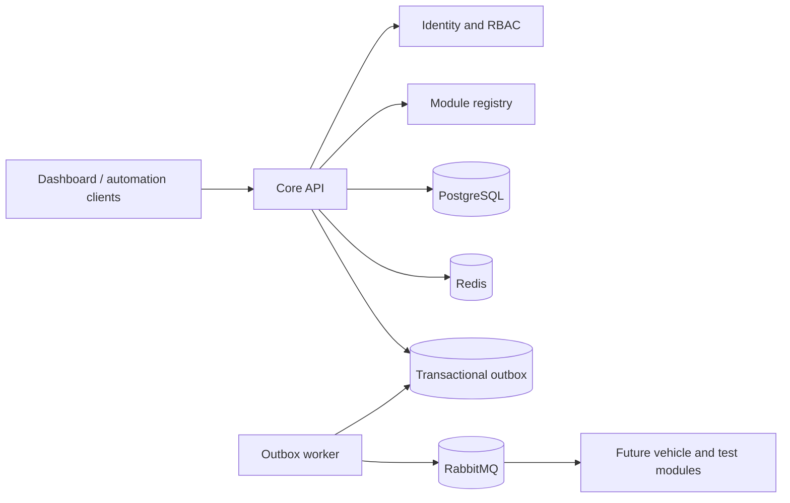

# Volume I architecture

## Architectural style

The first increment is a **modular control-plane service** plus independently deployable
workers. Domain boundaries are explicit Python packages and communicate through application
services or versioned events. A module is extracted into a microservice only when its load,
availability, ownership, or release cadence justifies the operational cost.

## Decisions

1. **PostgreSQL is the system of record.** Redis is reserved for ephemeral state, caching,
   rate limits, and distributed coordination.
2. **Events are at-least-once.** Consumers must be idempotent and use `event_id` for
   deduplication.
3. **The outbox closes the database/message gap.** State changes and pending events share a
   transaction; publishing occurs asynchronously.
4. **JWT access tokens are short lived.** Passwords use Argon2. Fine-grained authorization
   is expressed as namespaced permissions such as `users:read`.
5. **Configuration comes from the environment.** Secrets never enter source control.
6. **Every request has a correlation ID.** The same identifier is propagated into events and
   structured logs.
7. **The role catalogue is administered through versioned APIs.** Role names are canonical,
   permission changes are audited, assigned roles cannot be deleted, and `platform-admin`
   cannot be renamed, stripped of permissions, or deleted.
8. **Audit evidence is queryable but never mutable through the API.** Read and export use
   separate least-privilege permissions, bounded result sets, stable newest-first ordering,
   and indexed filters. CSV export is itself audited and does not replace controlled archive.
9. **Abuse controls use Redis atomic counters.** Authentication is bounded independently by
   normalized-account and network-client fingerprints, while versioned APIs are bounded by a
   credential or network-client fingerprint. Raw identities are never used as Redis keys. A
   limiter outage fails closed with a controlled HTTP 503 instead of silently bypassing policy.
10. **Module discovery uses an authoritative PostgreSQL catalogue.** ATEP modules declare
   canonical names, semantic versions, administrative status, and versioned capabilities.
   Registration and catalogue mutations append immutable audit evidence and transactional
   outbox events so future modules do not depend on direct database access.
11. **Operational availability is asserted by authenticated workloads.** An administrator
   issues or rotates a high-entropy module credential, the API persists only its SHA-256
   digest, and the raw value is returned once. Heartbeats may assert only `active` or
   `degraded` and renew a bounded lease. A background reconciler uses locked, skip-locked
   rows to mark expired modules `inactive`, append a system audit record, and enqueue a
   versioned availability event without producing evidence for every routine heartbeat.

## Initial bounded contexts

| Context | Responsibility | Storage |
|---|---|---|
| Identity | users, credentials, roles, permissions | PostgreSQL |
| Platform | health, configuration boundaries, API conventions | none |
| Events | event envelopes and reliable publication | PostgreSQL + RabbitMQ |
| Audit | immutable evidence, controlled search, and export | PostgreSQL |
| Registry | platform modules, workload credentials, availability leases, and capability declarations | PostgreSQL |

Future volumes add contexts without importing another context's persistence models. Shared
contracts live under an explicit version and remain backward compatible during migration.

## API and event conventions

- External endpoints are under `/api/v1`.
- Error responses use stable machine-readable codes.
- Timestamps are UTC ISO 8601 values.
- Identifiers are UUIDs.
- Events use `atep.<context>.<entity>.<past-tense-action>.v1` routing keys.
- Readiness checks dependencies; liveness checks only the process.

## Security baseline

- No default account or secret is committed.
- Bootstrap credentials are supplied only through environment variables.
- Authentication failures do not reveal whether an email exists.
- Authorization is deny-by-default.
- Containers run as an unprivileged user.
- Opaque refresh-token rotation and append-only administrative audit trails are implemented.
- Audit search and export are protected by `audit:read` and `audit:export`; no mutation or
  deletion endpoint exists.
- Redis-backed authentication and API rate limiting returns HTTP 429, `Retry-After`, and
  remaining/reset metadata after an atomic fixed-window threshold is exceeded.
- Module workload credentials are high entropy, stored only as SHA-256 digests, rotated by
  an authorized administrator, and used to renew bounded heartbeat leases. Operational
  status cannot be asserted through the administrative update API.
- Production follow-ups include proxy-aware client attribution, capacity tuning,
  secret-manager integration, and TLS/mTLS between workloads.
