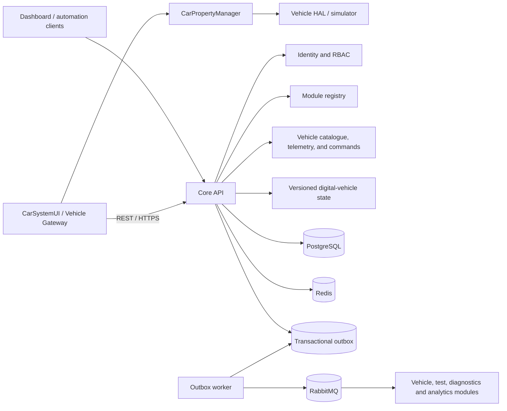

# Volume I architecture

## Architectural style

The first increment is a **modular control-plane service** plus independently deployable
workers. Domain boundaries are explicit Python packages and communicate through application
services or versioned events. A module is extracted into a microservice only when its load,
availability, ownership, or release cadence justifies the operational cost.

## Volume II boundary: digital-vehicle state

The first Volume II increment remains inside the modular monolith while establishing a distinct
domain boundary. Each registered vehicle owns exactly one state aggregate containing operational
mode plus battery, powertrain, brake, steering, and lighting components. The API exposes a safe
baseline through `GET /api/v1/vehicles/{vehicle_id}/state` and replaces the complete aggregate
through `PUT /api/v1/vehicles/{vehicle_id}/state`.

Updates use an expected version and a database row lock. A successful change increments the
version and commits state, audit evidence, and `atep.digital_vehicle.state.updated.v1` to the
transactional outbox atomically. Repeating the exact request is idempotent; a stale request with
different state fails with the stable `vehicle_state_version_conflict` error. Cross-component
validation prevents contradictory snapshots such as a moving parked vehicle or charging with the
traction motor enabled.

This aggregate is a control-plane representation, not yet a time-stepped physics model. Future
simulation engines, ECUs, CAN/UDS adapters, and AAOS/VHAL gateways will translate their state into
this contract rather than writing PostgreSQL directly.

## Volume III boundary: ECU simulator

Each electronic control unit belongs to one vehicle but has an independent lifecycle and versioned
state. The `atep.ecus` domain owns ECU identity, type, bounded sparse byte memory, and explicit fault
records. Nested REST APIs enforce `ecus:read` and `ecus:manage`; clients do not write state stores or
the message broker directly.

State replacement uses a row lock and expected version. Aggregate changes, minimized audit evidence,
and versioned outbox events commit atomically. The boundary remains independent of transport and
diagnostic protocols: CAN and UDS will reference the ECU aggregate in later volumes instead of
creating parallel controller models.

Each ECU now owns a monotonic logical clock and bounded cyclic-task definitions. Advance commands use
period arithmetic to summarize due work without wall-clock sleep or per-cycle storage. Reset commands
have fixed logical durations, persist replay identity, increment a boot counter, and apply the
defined memory-region persistence rules while preserving fault records.

Volume III-3 adds an immutable, versioned behavior-profile registry above that clock. A profile owns
allowed task schedules, bounded initial state, and deterministic counter transitions for one ECU
type. Profiles do not import CAN, UDS, or infrastructure adapters. This keeps controller behavior
reproducible while preserving protocol boundaries for later volumes.

Volume III-4 divides the sparse 16-bit memory map into explicit volatile and non-volatile regions.
Reset semantics operate on region metadata, while snapshots preserve bounded sparse cells with a
canonical checksum. Corruption uses a caller-provided seed and the persisted simulation-command
identity, so fault campaigns are reproducible and exact retries cannot apply changes twice.

Volume III-5 adds a logical-time fault lifecycle within the ECU aggregate. Observations increment
bounded occurrence or healing counters, thresholds control confirmation and healing, and latched
faults require an explicit clear command. A read-only DTC-candidate projection exposes diagnostic
intent without importing UDS types or assigning protocol-specific DTC numbers.

Volume III-6 adds bounded, strictly typed produced and consumed signal contracts to ECU state.
Publication uses ECU logical time and persisted replay identity. Gateway-owned routes connect
compatible signals between distinct ECUs and copy values under source/target version checks. The
boundary contains no CAN identifier, frame payload, DBC, arbitration, bitrate, or bus-error concept;
Volume IV adapters will translate these semantic signals to transport-specific representations.

Volume III-7 adds a vehicle-scoped scenario orchestrator above those ECU primitives. A bounded
scenario can advance logical clocks, observe faults, apply deterministically seeded corruption,
publish signals, and transfer gateway routes. It persists only bounded execution summaries,
before/after aggregate counts, and per-ECU logical-clock skew. It never treats host CPU, GPU,
memory, or elapsed wall time as simulated vehicle truth. A vehicle row lock serializes execution-ID
claims, while the surrounding API transaction makes all primitive mutations and final scenario
evidence atomic. CAN transport, UDS services, autonomous conditions, and real-time scheduling remain
outside this orchestration boundary.

## Decisions

1. **PostgreSQL is the system of record.** Redis is reserved for ephemeral state, caching,
   rate limits, and distributed coordination.
2. **Events are at-least-once.** Consumers must be idempotent and use `event_id` for
   deduplication.
3. **The outbox closes the database/message gap.** State changes and pending events share a
   transaction; publishing occurs asynchronously.
4. **JWT access tokens are short lived.** Passwords use Argon2. Fine-grained authorization
   is expressed as namespaced permissions such as `users:read`.
5. **Configuration comes from the environment.** Secrets never enter source control.
6. **Every request has a correlation ID.** The same identifier is propagated into events and
   structured logs.
7. **The role catalogue is administered through versioned APIs.** Role names are canonical,
   permission changes are audited, assigned roles cannot be deleted, and `platform-admin`
   cannot be renamed, stripped of permissions, or deleted.
8. **Audit evidence is queryable but never mutable through the API.** Read and export use
   separate least-privilege permissions, bounded result sets, stable newest-first ordering,
   and indexed filters. CSV export is itself audited and does not replace controlled archive.
9. **Abuse controls use Redis atomic counters.** Authentication is bounded independently by
   normalized-account and network-client fingerprints, while versioned APIs are bounded by a
   credential or network-client fingerprint. Raw identities are never used as Redis keys. A
   limiter outage fails closed with a controlled HTTP 503 instead of silently bypassing policy.
10. **Module discovery uses an authoritative PostgreSQL catalogue.** ATEP modules declare
   canonical names, semantic versions, administrative status, and versioned capabilities.
   Registration and catalogue mutations append immutable audit evidence and transactional
   outbox events so future modules do not depend on direct database access.
11. **Operational availability is asserted by authenticated workloads.** An administrator
   issues or rotates a high-entropy module credential, the API persists only its SHA-256
   digest, and the raw value is returned once. Heartbeats may assert only `active` or
   `degraded` and renew a bounded lease. A background reconciler uses locked, skip-locked
   rows to mark expired modules `inactive`, append a system audit record, and enqueue a
   versioned availability event without producing evidence for every routine heartbeat.
12. **ATEP and CarSystemUI are one platform with two deployment boundaries.** CarSystemUI uses
   only the public ATEP API and never connects to PostgreSQL, Redis, or RabbitMQ. Vehicle-local
   properties flow through CarPropertyManager, CarService, and VHAL without first traversing
   ATEP. The Vehicle Gateway maps those properties into versioned ATEP contracts.
13. **Telemetry retries are idempotent.** A globally unique client `event_id` is persisted with
   the observation. An identical retry returns the original receipt without another outbox event;
   reuse of the identifier for different data returns a stable conflict. Telemetry persistence
   and `atep.vehicle.telemetry.received.v1` enqueueing share one database transaction.
14. **Human and workload identities remain separate.** Catalogue and telemetry-query operations
   use JWT/RBAC. The unattended Vehicle Gateway uses a hash-only module credential and must
   declare `vehicle.telemetry.publish`. The initial trusted-proxy SPIFFE boundary can replace the
   development token after live mTLS evidence without exposing infrastructure services to Android clients.
15. **Android delivery is store-before-send.** The CarSystemUI showcase records changed vehicle
   properties in a local persistent queue, preserves their identifiers and timestamps across
   retry, and exposes synchronized, pending, rejected, and disabled states in the UI.
16. **Vehicle evidence has explicit provenance.** `VehiclePropertySource` isolates UI and gateway
   logic from the deterministic simulator and read-only AAOS `CarPropertyManager` source. Explicit
   AAOS mode never falls back to simulation, inaccessible VHAL properties remain observable, and
   local mutation controls are removed while vehicle-originated evidence is displayed.
17. **Background retry is unique, constrained, and bounded.** A pending Android queue reconciles
   to one WorkManager job per vehicle. Work requires network connectivity, uses exponential
   backoff, retains queue order and original event identity, stops after eight worker attempts,
   and is cancelled when the queue is empty or gateway configuration is disabled.
18. **Rejected telemetry and exhausted retry require explicit disposition.** Permanent client
   rejection is retained separately with its non-sensitive reason and original event evidence.
   An operator may atomically return one event to the pending queue without changing identity or
   discard only that record. Exhausted work is not scheduled again until an explicit manual retry
   clears the terminal retry state.
19. **Vehicle commands use leased, capability-scoped delivery.** An operator with
   `vehicle_commands:write` creates an idempotent `set_property` request for one vehicle and one
   target module declaring `vehicle.commands.consume`. The gateway atomically claims the oldest
   available command with a bounded lease and a high-entropy claim token; only the SHA-256 digest
   is stored. Terminal acknowledgement is idempotent and evented. The Android executor accepts an
   explicit property allowlist, validates type/range and vehicle-state invariants, and refuses to
   mutate a read-only AAOS source. Lease expiry makes an unacknowledged idempotent property command
   available for recovery without granting Android direct infrastructure access.
20. **Test-run state is durable; live delivery is a replaceable projection.** PostgreSQL owns
   the canonical test-run lifecycle and the transactional outbox owns durable integration
   events. Creation is idempotent by external `run_id`. Status changes lock the row, require an
   expected version, and allow only reviewed transitions. Redis Pub/Sub fans committed snapshots
   to authenticated WebSocket clients across API replicas, but a Redis publication failure never
   rolls back authoritative state. Every message carries a monotonically increasing version so
   CarSystemUI can ignore duplicates and out-of-order delivery.
21. **Environment profiles are immutable reproducibility inputs.** A profile identifies the
   vehicle kind, property source, and a bounded JSON configuration. It moves only from `draft`
   to `active` to `archived`; edits after creation are replaced by a new profile identity rather
   than silently changing an executed baseline. A TestRun may reference only an active profile
   and copies its identifier, version, source, kind, and configuration into an immutable snapshot.
   Later archival therefore does not change the evidence needed to reproduce a completed run.
22. **Scheduled execution is a durable database boundary.** Operators create idempotent jobs with
   external job and target run identifiers. PostgreSQL owns the `scheduled`, `cancelled`, and
   `dispatched` lifecycle. Each scheduler replica selects a bounded oldest-first due batch using
   `FOR UPDATE SKIP LOCKED`; the generated queued TestRun, dispatched job state, system audit, and
   both outbox events share one transaction. Cancellation locks the job row and uses an expected
   version so it cannot race silently with dispatch.
23. **Artifact metadata and binary objects have separate authorities.** PostgreSQL owns the
   TestRun association, external artifact identity, media metadata, size, and SHA-256 evidence;
   an `ArtifactObjectStore` owns binary content. The development adapter streams to a temporary
   file and atomically promotes it under an internally generated key. Public contracts never
   expose that key or derive a path from the client filename. A failed metadata transaction
   triggers best-effort object cleanup. Production uses the same interface with durable S3-style
   object storage, lifecycle policy, encryption, malware scanning, and orphan reconciliation.
24. **Observability is correlated, bounded, and operationally isolated.** Every HTTP request
   receives a trace context and retains a caller's valid W3C parent. Structured logs, spans, and
   response headers share trace/correlation identifiers. Prometheus metrics label only the HTTP
   method, FastAPI route template, status, and bounded exception type; concrete paths and domain
   identifiers never enter labels. Trace recording and parent-based sampling are configurable,
   and OTLP export uses a replaceable Collector boundary. The provisioned Prometheus, Grafana,
   and Collector topology is optional and remains outside normal developer startup.
25. **Reliability policy is versioned separately from authoritative state.** Prometheus recording
   rules calculate HTTP availability/error and latency SLIs, while multi-window alerts express
   the initial 99.9% API objective. Registry health is a constant-size PostgreSQL aggregate over
   modules that have received workload credentials; it does not persist a second health model.
   The reconciler refreshes bounded status gauges, and alert annotations link to the operational
   runbook. The local Alertmanager baseline provides disposable delivery evidence; accountable
   production incident-management ownership and escalation remain deployment responsibilities.
26. **Domain telemetry follows process ownership and aggregate-only backlog measurement.** The API
   registry owns scheduler and WebSocket metrics. The independently deployed outbox worker owns a
   dedicated internal Prometheus registry on port 9101. Backlog count and oldest age come from
   constant-size SQL aggregates; record identifiers and unrestricted event/run/job labels never
   enter metrics. Publication failures retain at-least-once state and trigger bounded worker retry.
27. **Development alert delivery is local, aggregate-only, and replaceable.** Prometheus sends
   firing and resolved alerts to a pinned Alertmanager. Alertmanager groups by alert name, service,
   and severity; critical alerts inhibit warnings for the same service. Its only receiver is an
   internal FastAPI webhook that validates a bounded payload and exports aggregate counters without
   persisting labels or annotations. Host ports bind to loopback. Production notification providers,
   credentials, ownership schedules, and escalation policy remain deployment-specific adapters.
28. **Dependency and object-store telemetry is measured at existing boundaries.** Readiness records
   duration, bounded outcome, and current state for PostgreSQL, Redis, and RabbitMQ. A decorator
   instruments the replaceable artifact-store protocol with fixed operation/outcome labels, byte
   counters, and optional capacity reporting. Keys, filenames, endpoints, exception messages, and
   domain identifiers never enter labels. Telemetry failure must not alter authoritative state.
29. **Supply-chain inputs are immutable and independently evidenced.** Linux x86-64/Python 3.14 is
   the canonical dependency-lock platform because it matches the digest-pinned official Python
   3.14.6/Alpine 3.24 runtime container; CI still tests Python 3.12 as the supported minimum. Runtime and
   development graphs, including build requirements, are committed with SHA-256 hashes. The runtime
   base image is digest-pinned and third-party workflow actions use full commit SHAs. Separate CI
   jobs scan repository history, Python dependencies, Python source, and the built image while
   retaining CycloneDX SBOM evidence. Scanner exceptions must match an exact advisory, package,
   version, and type, name an owner and review date, and expire; all other findings remain gated.
   Dependabot proposes reviewed updates without weakening pins.
30. **Kubernetes rollout is phased and fails closed.** Foundation, cluster-scoped admission, migration, and workloads render
   independently so operators must retain successful schema evidence before application rollout.
   No Secret object or credential value is versioned. A zero image digest blocks deployment until
   a reviewed environment overlay supplies the same immutable application digest to migration and
   workloads. Restricted Pod Security, tokenless ServiceAccounts, bounded resources, explicit
   probes, persistent evidence storage, and default-deny networking form the initial runtime policy.
31. **Forwarded workload identity has an explicit trust boundary.** ATEP accepts exactly one
   `spiffe://<trust-domain>/atep/module/<module-name>` identity only from a configured direct-peer
   proxy network. A presented XFCC value that is disabled, untrusted, malformed, ambiguous, or
   mismatched fails closed and never downgrades to a valid shared token. The proxy owns certificate
   verification and header replacement; ATEP owns canonical identity-to-registry matching and
   capability authorization. The shared module token remains a migration path only when XFCC is
   absent.
32. **Recovery is evidenced by restore, not archive creation alone.** The initial application
   database drill creates a portable custom-format PostgreSQL dump, validates the archive, restores
   it into a random empty database, and compares Alembic revision, ordered schema, and every public
   table count. Application writers are quiesced only for deterministic comparison. CI retains an
   aggregate hash report, never the protected dump. Provider-native encrypted backups, immutable
   retention, WAL/PITR, artifact-object coordination, and deployed RPO/RTO evidence remain separate
   production controls.
33. **Image identity is enforced again at Kubernetes admission.** A separate cluster-scoped target
   follows the namespaced foundation. Promotion verifies signed
   provenance before producing an approved digest, while a native fail-closed
   `ValidatingAdmissionPolicy` independently rejects ATEP Deployments and Jobs that reference a
   mutable tag, another repository, a malformed digest, or the all-zero placeholder. The binding
   is scoped by an explicit namespace label and emits audit evidence. This native gate constrains
   image identity but does not replace cryptographic attestation verification or a future
   signature-aware admission controller.
34. **Cryptographic provenance is enforced by an independently deployed policy controller.** The
   `atep` namespace opts into the official GitHub/Sigstore admission path. Its committed values
   accept only SLSA v1 provenance whose GitHub Actions certificate subject identifies this
   repository's input-free `reusable-release-builder.yml` on `refs/heads/main`, and whose image matches the exact ATEP GHCR
   repository. No image exemption exists. The controller complements the native repository/digest
   policy and pre-promotion `gh` verification; chart installation, resolved digests, trust-root
   status, positive admission, and negative denial evidence remain operator-controlled cluster
   evidence rather than an implicit repository deployment.
9. **Evidence lifecycle boundary:** the reusable builder downloads the exact digest's GitHub
   attestation bundle and current Sigstore roots, verifies the archived provenance, and emits a
   hash-and-size manifest beside the release report and CycloneDX SBOM. It then creates a
   deterministic sealed ZIP and content-addressed receipt; a fresh job downloads and restores both
   before workflow success. The 90-day Actions artifact is a transfer package governed by the
   vendor-neutral immutable provider contract, not the product-lifetime archive. A normalized
   export gate validates exact provider object identity, read-back integrity, locked retention,
   encryption, workload identity, audit reference, and time ordering before emitting a
   non-replacing export receipt. The initial AWS S3 Object Lock adapter maps this boundary to an
   atomic conditional `PutObject`, `COMPLIANCE` retention, SSE-KMS, STS assumed-role identity, and
   exact-version streamed read-back without embedding credentials. Its Terraform foundation
   declares a non-destroyable versioned Object Lock bucket, rotated customer key, exact OIDC writer
   and separate restore roles, restrictive bucket policy, and multi-Region CloudTrail delivery to
   independently governed audit storage. CI validates only a mocked plan and never receives AWS
   credentials or applies the stack. A separately invoked read-only auditor verifies the observed
   account, S3, KMS, IAM/OIDC, and CloudTrail configuration and emits one bounded non-replacing
   report only after every control passes; routine CI still receives no AWS identity. A
   separately authorized revocation procedure preserves evidence before exact-digest attestation
   and package withdrawal.

## Initial bounded contexts

| Context | Responsibility | Storage |
|---|---|---|
| Identity | users, credentials, roles, permissions | PostgreSQL |
| Platform | health, configuration boundaries, API conventions | none |
| Events | event envelopes and reliable publication | PostgreSQL + RabbitMQ |
| Audit | immutable evidence, controlled search, and export | PostgreSQL |
| Registry | platform modules, workload credentials, availability leases, and capability declarations | PostgreSQL |
| Vehicles | vehicle catalogue, lifecycle state, immutable observations, and gateway integration contracts | PostgreSQL |
| Test runs | vehicle-scoped execution lifecycle, progress, result summary, audit, and live projections | PostgreSQL + Redis Pub/Sub |
| Environment profiles | immutable, versioned vehicle/test baselines and reproducibility inputs | PostgreSQL |
| Test jobs | durable scheduling, cancellation, due-work ownership, and TestRun dispatch | PostgreSQL |
| Test artifacts | immutable TestRun evidence metadata, integrity, and binary-object abstraction | PostgreSQL + object storage |
| Observability | bounded metrics/traces, SLO rules, alert evaluation, local routing/inhibition, aggregate delivery evidence, correlation, and dashboards | PostgreSQL aggregates + process-local registries + Prometheus + Alertmanager + OpenTelemetry Collector + Grafana |

Future volumes add contexts without importing another context's persistence models. Shared
contracts live under an explicit version and remain backward compatible during migration.

## API and event conventions

- External endpoints are under `/api/v1`.
- Error responses use stable machine-readable codes.
- Timestamps are UTC ISO 8601 values.
- Internal identifiers are UUIDs; externally meaningful vehicle identifiers are canonical slugs.
- Events use `atep.<context>.<entity>.<past-tense-action>.v1` routing keys.
- Readiness checks dependencies; liveness checks only the process.

## Security baseline

- No default account or secret is committed.
- Bootstrap credentials are supplied only through environment variables.
- Authentication failures do not reveal whether an email exists.
- Authorization is deny-by-default.
- Containers run as an unprivileged user.
- Runtime and development dependencies are installed from hash-locked manifests; the runtime base
  image and every third-party CI action are pinned to immutable identifiers.
- CI scans history with Gitleaks, audits Python packages, analyses Python with CodeQL, generates
  CycloneDX SBOMs, and rejects high or critical vulnerabilities in the built container image
  unless an exact, documented, owned, and time-bounded exception applies.
- Dependabot proposes weekly Python, GitHub Actions, and Docker updates for review.
- Kubernetes workloads enforce the Restricted profile, run non-root with read-only root filesystems,
  drop all Linux capabilities, disable ServiceAccount token automount, and consume only an
  externally materialized runtime Secret.
- Opaque refresh-token rotation and append-only administrative audit trails are implemented.
- Audit search and export are protected by `audit:read` and `audit:export`; no mutation or
  deletion endpoint exists.
- Redis-backed authentication and API rate limiting returns HTTP 429, `Retry-After`, and
  remaining/reset metadata after an atomic fixed-window threshold is exceeded.
- Module workload credentials are high entropy, stored only as SHA-256 digests, rotated by
  an authorized administrator, and used to renew bounded heartbeat leases. Operational
  status cannot be asserted through the administrative update API.
- SPIFFE module identity is accepted only through a configured trusted mTLS proxy. XFCC input is
  canonical, single-valued, fail-closed, and cannot grant capabilities absent from the registry.
- PostgreSQL recovery evidence requires an isolated successful restore and equality checks. CI
  deletes the logical dump and temporary database and retains no credentials, table names, or rows.
- Vehicle Gateway telemetry requires both a valid module credential and the
  `vehicle.telemetry.publish` capability. Replayed event IDs cannot create duplicate evidence.
- Vehicle command claim and acknowledgement require the `vehicle.commands.consume` capability;
  raw claim tokens are returned only with a successful claim and are stored only as SHA-256
  digests. Android executes only the reviewed `set_property` allowlist.
- Test-run REST mutations require `test_runs:write`; queries and WebSocket subscriptions require
  `test_runs:read`. WebSocket authentication revalidates active user state and never exposes Redis.
- Environment profile discovery and lifecycle management use independent
  `environment_profiles:read` and `environment_profiles:manage` permissions. Configuration is
  JSON-compatible, bounded to 16 KiB, and excluded from secret storage by design.
- Test-job discovery and mutation use independent `test_jobs:read` and `test_jobs:manage`
  permissions. The application scheduler never grants a client direct database or broker access.
- Artifact upload and retrieval use independent `test_artifacts:write` and
  `test_artifacts:read` permissions. Uploads are bounded, filenames are portable metadata only,
  and downloads disclose integrity headers rather than internal storage locations.
- `/metrics`, Prometheus, Grafana, Collector, and OTLP are management-plane surfaces. Local
  anonymous Grafana access is disposable-only; production requires network isolation, TLS,
  workload authentication, access audit, and retention controls.
- Production follow-ups include proxy-aware client attribution, capacity tuning,
  secret-manager integration, live proxy/certificate lifecycle evidence, artifact signing, and verifiable
  build provenance.
# Volume IV CAN Network Boundary

The `atep.can_network` module owns vehicle-scoped CAN topology, classic frame identifiers, DLC,
payload evidence, deterministic sequence, and logical bus time. It references Volume III ECUs rather
than duplicating controller state. Its arbitration service resolves bounded batches against frame
contracts, selects the lowest ready identifier, calculates nominal classic CAN duration, serializes
winners, records consumer delivery, and reports bus utilization. Batch request/result evidence and
individual winner transmissions are persisted atomically with audit and outbox records. DBC
catalogues map structured signals to existing frame contracts. The codec applies exact decimal
scaling, offsets, signed raw ranges, Intel LSB-first placement, and Motorola DBC sawtooth placement;
it persists replay-safe encode/decode evidence without exposing values in audit or events. The CAN
FD extension adds 64-byte payload contracts, dual-rate phase timing, BRS evidence, and deterministic
mixed classic/FD arbitration. Error confinement is aggregate-owned JSON state; replay-safe fault
executions apply TEC/REC transitions, frame loss, bus-off exclusion, and explicit recovery under the
same network row lock used by frame commands. Audit/outbox evidence is committed in the same
transaction and excludes payload bytes. Textual DBC parsing, multiplexing, bit stuffing,
acknowledgement, retransmission, physical adapters, and payload transformation remain later increments.

IV-6 extends the aggregate into a bounded multi-bus model without giving Android clients or external
modules direct access to transport infrastructure. LIN channels, Ethernet segments, and transparent
gateway routes are stored as versioned contracts. A route must cross protocol boundaries through a
node with gateway role and preserves payload length; protocol-specific transformation remains an
explicit future feature. The route executor locks the aggregate, derives destination duration from
logical inputs, advances sequence and simulation time once, and atomically persists replay, audit,
and outbox evidence without payload bytes.

IV-7 adds an atomic campaign boundary above stored gateway routes. A campaign prevalidates every
step before mutation, then derives ordered route traces, destination-protocol timing, logical idle
and occupied time, utilization, maximum and nearest-rank p95 latency, protocol counts, outcomes,
and latency-budget violations. Explicit frame-loss and gateway-unavailable modes create integrated
failure evidence without host-time dependence. A SHA-256 fingerprint supports exact replay while
the persisted request summary, trace, audit, and outbox omit payload byte values.

# Volume V Diagnostics Boundary

The `atep.diagnostics` module owns externally observable diagnostic sessions, UDS command evidence,
and DTC persistence. It references a Volume III ECU and its logical clock without importing ECU
memory, signal, or internal fault ownership. A future bridge may promote confirmed fault candidates
to DTC reports, but the two lifecycles remain explicit and independently testable.

V-1 implements Diagnostic Session Control (`0x10`), the Read DTC Information (`0x19`) query
boundary, and Clear Diagnostic Information (`0x14`) for the all-DTC group. Positive response IDs
and selected negative response codes are retained as protocol evidence while HTTP/OpenAPI remains
the public control-plane transport. ISO-TP, CAN PDU framing, and DoIP are future adapters.

V-2 adds an ECU-scoped typed DID catalogue plus Read Data by Identifier (`0x22`) and Write Data by
Identifier (`0x2E`). Reads are bounded to sixteen unique identifiers; writes require an explicitly
writable DID, an authorized active session, matching session/DID versions, and a valid typed value.
Exact results retain values for replay, while shared audit and outbox evidence contains only DID
identifiers, counts, service identities, and versions.

V-3 adds Routine Control (`0x31`) through a bounded ECU routine catalogue and a separate execution
state. Start, stop, and request-results subfunctions are active-session authorized and
optimistic-versioned. Completion derives exclusively from ECU simulation time. Routine parameters
and results remain in protected state/command evidence for truthful replay and are excluded from
shared audit and outbox payloads.

V-4 adds Security Access (`0x27`) as a separate one-to-one ECU security state while the current
unlocked level remains visible on the diagnostic session. Seed expiry, invalid-attempt counting,
and lockout use ECU logical time. Successful and denied commands are idempotent evidence; invalid
attempts commit before the stable negative response. Raw keys are masked and never persisted, and
shared audit/outbox evidence excludes seeds, keys, and key digests. The deterministic derivation is
explicitly a test simulator boundary rather than production cryptography.

V-5 adds ECU Reset (`0x11`) as a cross-volume application service. It calls the existing Volume III
reset lifecycle instead of duplicating memory, boot, fault, or operational-state rules. The ECU
mutation and its native evidence share one transaction with the default-session transition,
Security Access invalidation, UDS command evidence, diagnostic audit, and diagnostic outbox event.
Hard and key-off/on reset require level-1 authorization; soft reset still requires a non-default
session. ECU, session, and security versions make concurrent or stale requests explicit.

Each ECU owns one current, optimistic-versioned diagnostic session. Mutating commands have
ECU-scoped idempotency identities. Exact retry returns stored evidence; changed reuse is rejected.
DTCs use ECU simulation time, retain bounded snapshots in protected persistence, and exclude those
measurements from audit and outbox events. State, command/DTC mutation, audit, and outbox writes
share one PostgreSQL transaction and independent `diagnostics:read`/`diagnostics:manage` RBAC.
