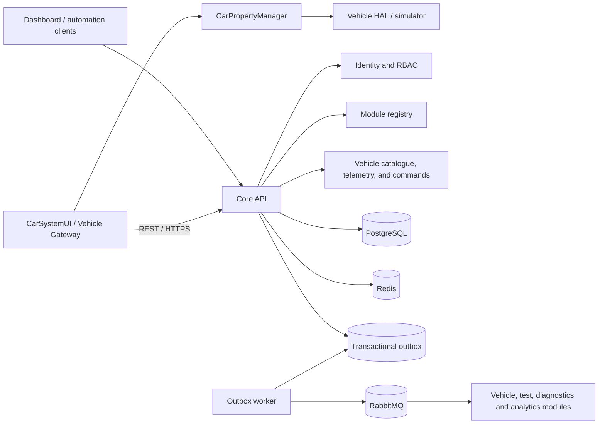

# Volume I architecture

## Architectural style

The first increment is a **modular control-plane service** plus independently deployable
workers. Domain boundaries are explicit Python packages and communicate through application
services or versioned events. A module is extracted into a microservice only when its load,
availability, ownership, or release cadence justifies the operational cost.

## Decisions

1. **PostgreSQL is the system of record.** Redis is reserved for ephemeral state, caching,
   rate limits, and distributed coordination.
2. **Events are at-least-once.** Consumers must be idempotent and use `event_id` for
   deduplication.
3. **The outbox closes the database/message gap.** State changes and pending events share a
   transaction; publishing occurs asynchronously.
4. **JWT access tokens are short lived.** Passwords use Argon2. Fine-grained authorization
   is expressed as namespaced permissions such as `users:read`.
5. **Configuration comes from the environment.** Secrets never enter source control.
6. **Every request has a correlation ID.** The same identifier is propagated into events and
   structured logs.
7. **The role catalogue is administered through versioned APIs.** Role names are canonical,
   permission changes are audited, assigned roles cannot be deleted, and `platform-admin`
   cannot be renamed, stripped of permissions, or deleted.
8. **Audit evidence is queryable but never mutable through the API.** Read and export use
   separate least-privilege permissions, bounded result sets, stable newest-first ordering,
   and indexed filters. CSV export is itself audited and does not replace controlled archive.
9. **Abuse controls use Redis atomic counters.** Authentication is bounded independently by
   normalized-account and network-client fingerprints, while versioned APIs are bounded by a
   credential or network-client fingerprint. Raw identities are never used as Redis keys. A
   limiter outage fails closed with a controlled HTTP 503 instead of silently bypassing policy.
10. **Module discovery uses an authoritative PostgreSQL catalogue.** ATEP modules declare
   canonical names, semantic versions, administrative status, and versioned capabilities.
   Registration and catalogue mutations append immutable audit evidence and transactional
   outbox events so future modules do not depend on direct database access.
11. **Operational availability is asserted by authenticated workloads.** An administrator
   issues or rotates a high-entropy module credential, the API persists only its SHA-256
   digest, and the raw value is returned once. Heartbeats may assert only `active` or
   `degraded` and renew a bounded lease. A background reconciler uses locked, skip-locked
   rows to mark expired modules `inactive`, append a system audit record, and enqueue a
   versioned availability event without producing evidence for every routine heartbeat.
12. **ATEP and CarSystemUI are one platform with two deployment boundaries.** CarSystemUI uses
   only the public ATEP API and never connects to PostgreSQL, Redis, or RabbitMQ. Vehicle-local
   properties flow through CarPropertyManager, CarService, and VHAL without first traversing
   ATEP. The Vehicle Gateway maps those properties into versioned ATEP contracts.
13. **Telemetry retries are idempotent.** A globally unique client `event_id` is persisted with
   the observation. An identical retry returns the original receipt without another outbox event;
   reuse of the identifier for different data returns a stable conflict. Telemetry persistence
   and `atep.vehicle.telemetry.received.v1` enqueueing share one database transaction.
14. **Human and workload identities remain separate.** Catalogue and telemetry-query operations
   use JWT/RBAC. The unattended Vehicle Gateway uses a hash-only module credential and must
   declare `vehicle.telemetry.publish`. OAuth2 workload tokens or mTLS may replace this development
   mechanism without exposing infrastructure services to Android clients.
15. **Android delivery is store-before-send.** The CarSystemUI showcase records changed vehicle
   properties in a local persistent queue, preserves their identifiers and timestamps across
   retry, and exposes synchronized, pending, rejected, and disabled states in the UI.
16. **Vehicle evidence has explicit provenance.** `VehiclePropertySource` isolates UI and gateway
   logic from the deterministic simulator and read-only AAOS `CarPropertyManager` source. Explicit
   AAOS mode never falls back to simulation, inaccessible VHAL properties remain observable, and
   local mutation controls are removed while vehicle-originated evidence is displayed.
17. **Background retry is unique, constrained, and bounded.** A pending Android queue reconciles
   to one WorkManager job per vehicle. Work requires network connectivity, uses exponential
   backoff, retains queue order and original event identity, stops after eight worker attempts,
   and is cancelled when the queue is empty or gateway configuration is disabled.
18. **Rejected telemetry and exhausted retry require explicit disposition.** Permanent client
   rejection is retained separately with its non-sensitive reason and original event evidence.
   An operator may atomically return one event to the pending queue without changing identity or
   discard only that record. Exhausted work is not scheduled again until an explicit manual retry
   clears the terminal retry state.
19. **Vehicle commands use leased, capability-scoped delivery.** An operator with
   `vehicle_commands:write` creates an idempotent `set_property` request for one vehicle and one
   target module declaring `vehicle.commands.consume`. The gateway atomically claims the oldest
   available command with a bounded lease and a high-entropy claim token; only the SHA-256 digest
   is stored. Terminal acknowledgement is idempotent and evented. The Android executor accepts an
   explicit property allowlist, validates type/range and vehicle-state invariants, and refuses to
   mutate a read-only AAOS source. Lease expiry makes an unacknowledged idempotent property command
   available for recovery without granting Android direct infrastructure access.
20. **Test-run state is durable; live delivery is a replaceable projection.** PostgreSQL owns
   the canonical test-run lifecycle and the transactional outbox owns durable integration
   events. Creation is idempotent by external `run_id`. Status changes lock the row, require an
   expected version, and allow only reviewed transitions. Redis Pub/Sub fans committed snapshots
   to authenticated WebSocket clients across API replicas, but a Redis publication failure never
   rolls back authoritative state. Every message carries a monotonically increasing version so
   CarSystemUI can ignore duplicates and out-of-order delivery.

## Initial bounded contexts

| Context | Responsibility | Storage |
|---|---|---|
| Identity | users, credentials, roles, permissions | PostgreSQL |
| Platform | health, configuration boundaries, API conventions | none |
| Events | event envelopes and reliable publication | PostgreSQL + RabbitMQ |
| Audit | immutable evidence, controlled search, and export | PostgreSQL |
| Registry | platform modules, workload credentials, availability leases, and capability declarations | PostgreSQL |
| Vehicles | vehicle catalogue, lifecycle state, immutable observations, and gateway integration contracts | PostgreSQL |
| Test runs | vehicle-scoped execution lifecycle, progress, result summary, audit, and live projections | PostgreSQL + Redis Pub/Sub |

Future volumes add contexts without importing another context's persistence models. Shared
contracts live under an explicit version and remain backward compatible during migration.

## API and event conventions

- External endpoints are under `/api/v1`.
- Error responses use stable machine-readable codes.
- Timestamps are UTC ISO 8601 values.
- Internal identifiers are UUIDs; externally meaningful vehicle identifiers are canonical slugs.
- Events use `atep.<context>.<entity>.<past-tense-action>.v1` routing keys.
- Readiness checks dependencies; liveness checks only the process.

## Security baseline

- No default account or secret is committed.
- Bootstrap credentials are supplied only through environment variables.
- Authentication failures do not reveal whether an email exists.
- Authorization is deny-by-default.
- Containers run as an unprivileged user.
- Opaque refresh-token rotation and append-only administrative audit trails are implemented.
- Audit search and export are protected by `audit:read` and `audit:export`; no mutation or
  deletion endpoint exists.
- Redis-backed authentication and API rate limiting returns HTTP 429, `Retry-After`, and
  remaining/reset metadata after an atomic fixed-window threshold is exceeded.
- Module workload credentials are high entropy, stored only as SHA-256 digests, rotated by
  an authorized administrator, and used to renew bounded heartbeat leases. Operational
  status cannot be asserted through the administrative update API.
- Vehicle Gateway telemetry requires both a valid module credential and the
  `vehicle.telemetry.publish` capability. Replayed event IDs cannot create duplicate evidence.
- Vehicle command claim and acknowledgement require the `vehicle.commands.consume` capability;
  raw claim tokens are returned only with a successful claim and are stored only as SHA-256
  digests. Android executes only the reviewed `set_property` allowlist.
- Test-run REST mutations require `test_runs:write`; queries and WebSocket subscriptions require
  `test_runs:read`. WebSocket authentication revalidates active user state and never exposes Redis.
- Production follow-ups include proxy-aware client attribution, capacity tuning,
  secret-manager integration, and TLS/mTLS between workloads.
